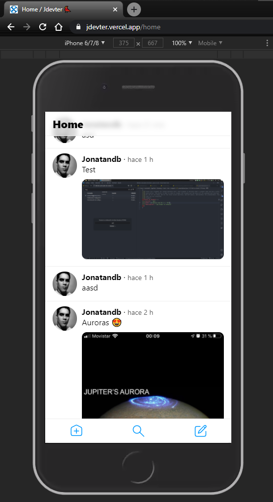

Proyecto creado siguiendo esta serie de videos -> [🔥 Curso gratuito de Next.js y Firebase](https://midu.dev/curso-gratis-react-2020/) ([Lista en Youtube](https://www.youtube.com/playlist?list=PLV8x_i1fqBw1VR86y4C72xMGJ8ifjBwJ6)), de este grande del desarrollo frontend -> **Midudev** (Miguel Ángel Durán: [Blog](https://midu.dev/), [Youtube](https://www.youtube.com/channel/UC8LeXCWOalN8SxlrPcG-PaQ), [Twitter](https://twitter.com/midudev), [Instagram](https://www.instagram.com/midu.dev/))

---

# Jdevter 🐦 - Acerca de este proyecto:

Se trata de un clone de Twitter creado utilizando [NetxJs](https://nextjs.org/) y [Firebase](https://firebase.google.com/).

<p align="center">
    <a href="https://github.com/jonatandb/jdevter">
        
    </a>
</p>

---


### Visited sites / resources:

System UIcons - Free svg UI icons: https://systemuicons.com/

Spinners by: https://loading.io/css and http://www.ajaxload.info/ and http://ajaxloadingimages.net/

Transform SVGs into React components: https://react-svgr.com/

Favicon generator: https://www.favicon-generator.org/

PNG transparenncy creator: https://onlinepngtools.com/create-transparent-png

Logo creator: https://www.freelogoservices.com/es

---
---
---


This is a [Next.js](https://nextjs.org/) project bootstrapped with [`create-next-app`](https://github.com/vercel/next.js/tree/canary/packages/create-next-app).

## Getting Started

First, run the development server:

```bash
npm run dev
# or
yarn dev
```

Open [http://localhost:3000](http://localhost:3000) with your browser to see the result.

You can start editing the page by modifying `pages/index.js`. The page auto-updates as you edit the file.

## Learn More

To learn more about Next.js, take a look at the following resources:

- [Next.js Documentation](https://nextjs.org/docs) - learn about Next.js features and API.
- [Learn Next.js](https://nextjs.org/learn) - an interactive Next.js tutorial.

You can check out [the Next.js GitHub repository](https://github.com/vercel/next.js/) - your feedback and contributions are welcome!

## Deploy on Vercel

The easiest way to deploy your Next.js app is to use the [Vercel Platform](https://vercel.com/import?utm_medium=default-template&filter=next.js&utm_source=create-next-app&utm_campaign=create-next-app-readme) from the creators of Next.js.

Check out our [Next.js deployment documentation](https://nextjs.org/docs/deployment) for more details.
